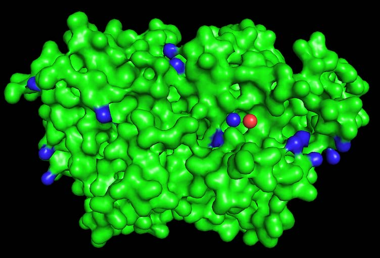
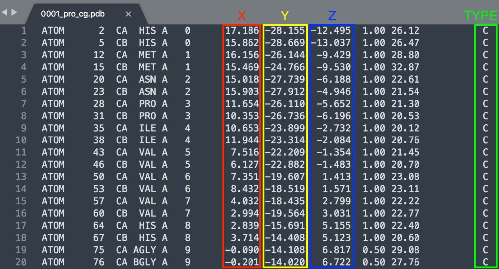
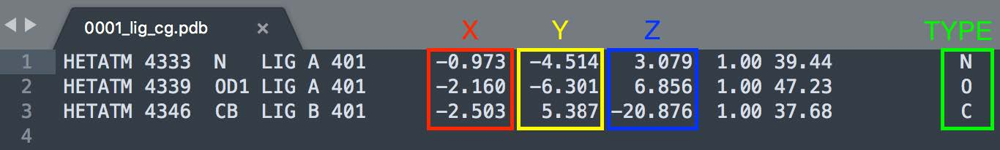
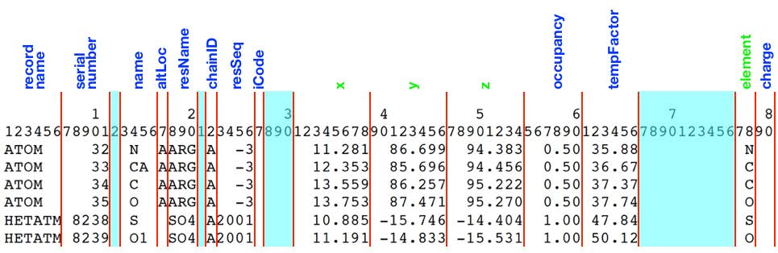
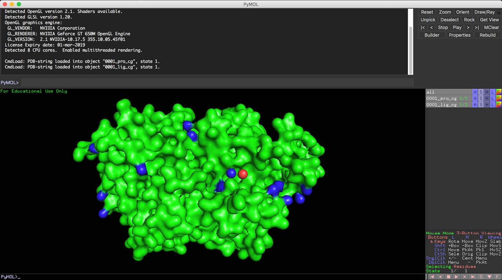

# DeepPL

Predicting Protein – Ligand Interaction by using Deep Learning Models

# Background
Molecular recognition between proteins and ligands plays an important role in many biological processes, such as membrane receptor signaling and enzyme catalysis. Predicting the structures of protein-ligand complexes and and finding ligands by virtual screening of small molecule databases are two long-standing goals in molecular biophysics and medicinal chemistry [[1](https://en.wikipedia.org/wiki/Protein), [2](https://en.wikipedia.org/wiki/Protein_structure)]. Knowledge-based statistical potentials have been developed for modeling protein-ligand interactions. They are based on distributions of intermolecular features in large databases of protein-ligand complexes. Over the past decade, deep learning has achieved remarkable success in various artificial intelligence research areas. Evolved from the previous research on artificial neural networks, this technology has shown superior performance to other machine learning algorithms in areas such as image and voice recognition, natural language processing, among others. The first wave of applications of deep learning in pharmaceutical research has emerged in recent years, and its utility has gone beyond bioactivity predictions and has shown promise in addressing diverse problems in drug discovery [[3](https://en.wikipedia.org/wiki/Drug_design)].

# Training Dataset
In our dataset, there are ~3000 protein-ligand complexes that were determined experimentally with 3D structures available (For now, we are providing 100 of them). Each protein (xxxx_pro_cg_.pdb) and its ligand (xxxx_lig_cg_.pdb) are of one-to-one correspondence, i.e. they can bind to each other and make protein-ligand complex. For each protein-ligand complex, protein and ligand data are provided in xxxx_pro_cg_.pdb and xxxx_lig_cg_.pdb files, respectively [[4](#f4)]. Due to one-to-one correspondence, only matching pairs of protein and ligand can make protein-ligand complex. In other words, xxxx_pro_cg_.pdb and yyyy_lig_cg_.pdb cannot make protein-ligand complex. Proteins and ligands are consisting of atoms and these atoms forming the structure of them (characterize them) by coming together. Protein and ligand data files contain (x, y, z) coordinates of each atom of the proteins and ligands. There is a 4th feature containing atom type. In Figure 1 and Figure 2, data structure of these files are shown for protein and ligand data files. All data fields are also shown in Figure 3 in protein and ligand files. For the detailed description of each field, please refer to pp.180-182 and pp.187-188 of [[4](ftp://ftp.wwpdb.org/pub/pdb/doc/format_descriptions/Format_v33_A4.pdf)].

*Figure 1: Data structure in protein data files*

*Figure 2: Data structure in ligand data files*

*Figure 3: Data fields in a protein and ligand data files*

In this project, we are solely interested in coordinates and types of the atoms (which are indicated in Figure 1 and Figure 2) constructing the structure of the proteins and ligands. In the “TYPE” field, atom types are given as: ‘C - Carbon’, ‘O – Oxygen’, ‘N – Nitrogen’, etc. In this project, we will not use atom types directly; instead we will treat them either as hydrophobic or polar. ‘C’ is interpreted as hydrophobic and the rest is interpreted as polar. The reason why we haven’t changed them to hydrophobic (‘h’) and polar (‘p’) in our dataset is that you may visualize the structure of proteins and ligands by using some open-source software like PyMOL, which requires actual atom types [[5](https://pymol.org/2/#download), [6](http://pymol.sourceforge.net/newman/userman.pdf)]. Visualization of protein1 and ligand1 with PyMOL software is shown in Figure 4. An example python script (read_pdb_file.py) is also provided for reading pdb files to extract atom coordinates and atom types.

*Figure 4: Visualizing protein and ligand structure in PyMOL*

# References
1. https://en.wikipedia.org/wiki/Protein
2. https://en.wikipedia.org/wiki/Protein_structure
3. https://en.wikipedia.org/wiki/Drug_design
4. ftp://ftp.wwpdb.org/pub/pdb/doc/format_descriptions/Format_v33_A4.pdf
5. https://pymol.org/2/#download
6. http://pymol.sourceforge.net/newman/userman.pdf

This README is taken from CS5242 project description minus the grading evaluation section.
